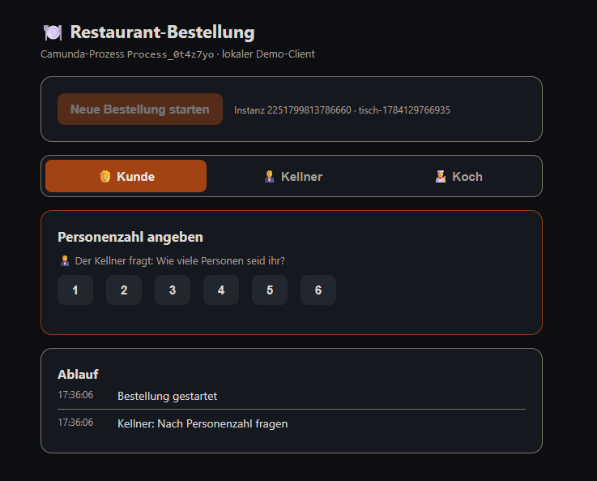
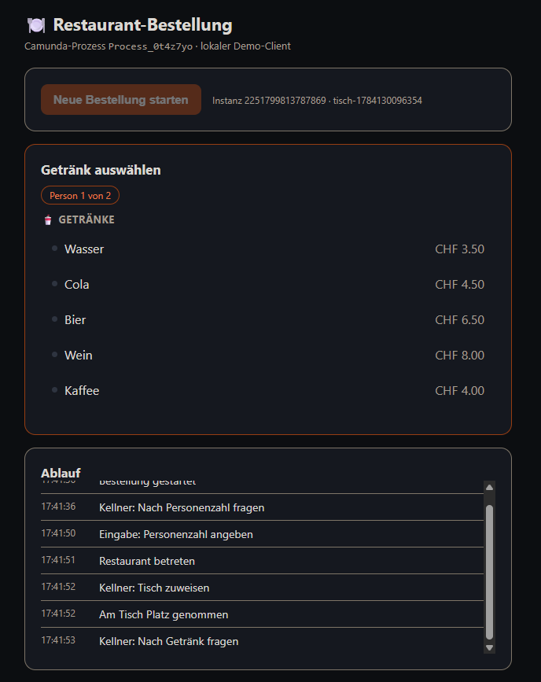
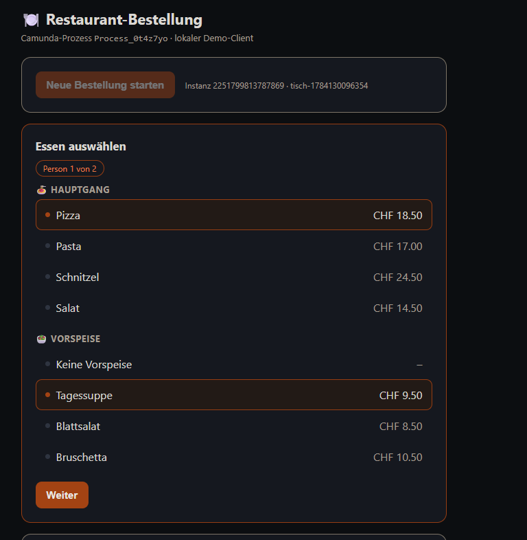
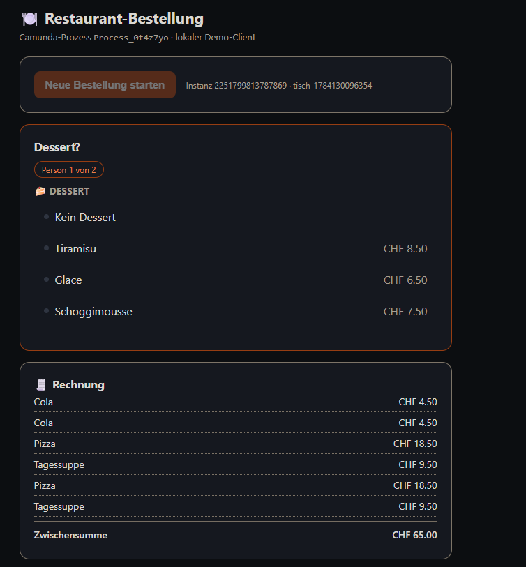
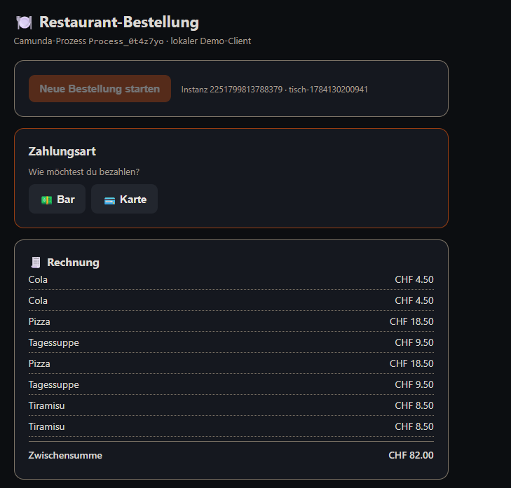
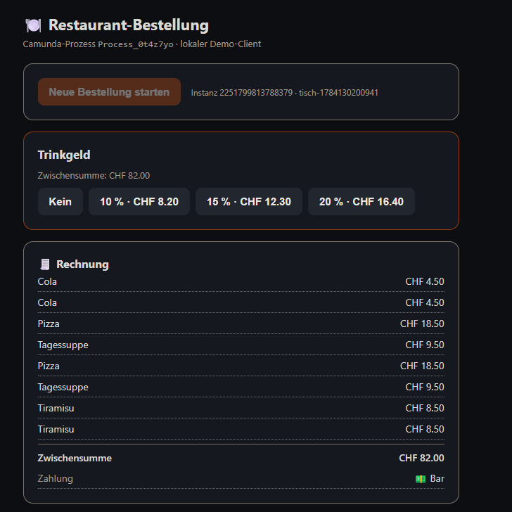
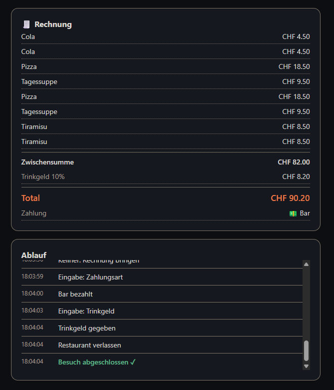
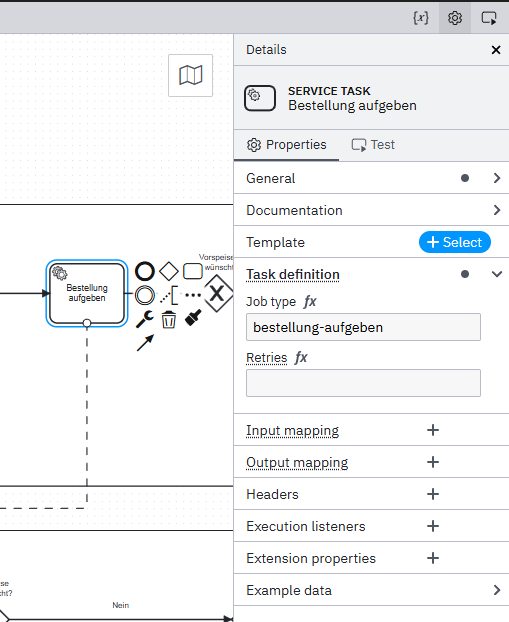
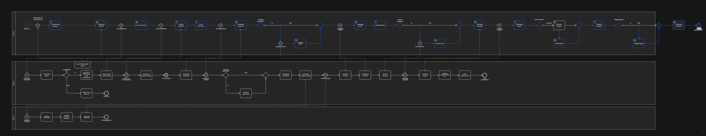

<div align="center">

# 🍽️ Restaurant Bestellprozess

### Ein vollständig ausführbarer Geschäftsprozess in Camunda 8

Projektarbeit Modul 254 · Technische Richtung · BPMN 2.0 in der Camunda Workflow Engine


</div>

---

## Inhalt

* [Über das Projekt](#über-das-projekt)
* [Architektur](#architektur)
* [Die drei Pools](#die-drei-pools)
* [Ablauf einer Bestellung](#ablauf-einer-bestellung)
* [Nachrichtenchoreografie](#nachrichtenchoreografie)
* [Technik im Detail](#technik-im-detail)
* [Installation und Start](#installation-und-start)
* [Projektstruktur](#projektstruktur)
* [Erfüllung der Anforderungen](#erfüllung-der-anforderungen)
* [Technologie](#technologie)

---

## Über das Projekt

Der komplette Ablauf eines Restaurantbesuchs, vom Betreten über Bestellung und
Essen bis zur Zahlung, ist als ausführbarer BPMN Prozess modelliert. Ein Gast
steuert den Ablauf über eine schlanke Weboberfläche. Camunda 8 führt den Prozess
Schritt für Schritt aus, und in Camunda Operate lässt sich live mitverfolgen, wie
der Token durch das Modell wandert.

Das Projekt verbindet damit drei Welten: die fachliche Modellierung in BPMN 2.0,
die technische Ausführung in der Camunda Workflow Engine und eine eigene
Weboberfläche als Benutzerschnittstelle.

<div align="center">
  
  <br><em>Das vollständige Kollaborationsdiagramm mit den Pools Kunde, Kellner und Küche</em>
</div>

---

## Architektur

Die Lösung besteht aus drei Schichten, die über REST miteinander sprechen.

```
┌────────────────────────────────────────────────────────┐
│   Weboberfläche   ·   Kundensicht   ·   localhost:3000  │
│   Bestellung starten, Getränk, Essen, Dessert, Zahlung  │
└────────────────────────────────────────────────────────┘
                          │  REST
                          ▼
┌────────────────────────────────────────────────────────┐
│   Backend   ·   server.js   ·   Node.js und Express     │
│   Job Worker   +   Nachrichten   +   Formulardaten      │
└────────────────────────────────────────────────────────┘
                          │  Camunda REST API v2
                          ▼
┌────────────────────────────────────────────────────────┐
│   Camunda 8   ·   Zeebe Engine   ·   localhost:8080     │
│                                                         │
│     Pool Kunde     ausführbar, steuert den Ablauf       │
│     Pool Kellner   fachlich modelliert                  │
│     Pool Küche     fachlich modelliert                  │
└────────────────────────────────────────────────────────┘
```

Der Kunde Prozess ist der ausführbare Kern. Kellner und Küche sind fachlich
vollständig modelliert und über Nachrichten mit dem Kunden verbunden.

---

## Die drei Pools

### Pool Kunde (ausführbar)

Das Herzstück. Er enthält den kompletten Besuch von Anfang bis Ende.

* **1 Startereignis:** Hunger o.ä
* **11 Service Tasks**, die das Backend automatisch abarbeitet: Restaurant
  betreten, an Tisch setzen, Bestellung aufgeben, Vorspeise essen, Hauptgang
  essen, Dessert essen, Rechnung verlangen, bar bezahlen, mit Karte bezahlen,
  Trinkgeld geben, Restaurant verlassen
* **6 User Tasks** mit Eingabe im Webinterface: Personenzahl, Getränk, Essen,
  Dessert, Zahlungsart, Trinkgeld
* **8 wartende Zwischenereignisse**, die je auf eine Nachricht vom Kellner warten
* **8 Gateways** für die Entscheidungen: Vorspeise gewünscht, Dessert gewünscht,
  bar oder Karte, Trinkgeld ja oder nein
* **1 Endereignis:** Besuch abgeschlossen

### Pool Kellner

Bildet die Arbeit des Kellners fachlich ab. Enthält 16 Aufgaben von "Nach
Personenzahl fragen" über "Bestellung aufnehmen" und "Bestellung eintippen
(iPad)" bis "Gäste verabschieden", dazu die Entscheidung "Genug Plätze frei?" mit
einem eigenen Ende "Kein Platz" für den Fall, dass das Restaurant voll ist.

### Pool Küche

Der kompakte dritte Pool: Bestellung erhalten, Gerichte zubereiten, Gericht
anrichten, als fertig markieren, Bestellung bereit.

---

## Ablauf einer Bestellung

Jeder Schritt im Webinterface entspricht einem Element im Prozess. Die folgenden
Aufnahmen zeigen einen kompletten Durchlauf mit zwei Personen.

<div align="center">

<table>
<tr>
<td align="center"><strong>Personenzahl</strong><br></td>
<td align="center"><strong>Getränk</strong><br></td>
<td align="center"><strong>Essen</strong><br></td>
</tr>
<tr>
<td align="center"><strong>Dessert</strong><br></td>
<td align="center"><strong>Zahlungsart</strong><br></td>
<td align="center"><strong>Trinkgeld</strong><br></td>
</tr>
</table>

</div>

Am Ende steht die fertige Rechnung mit Zwischensumme, Trinkgeld und Zahlungsart.

<div align="center">
  
</div>

---

## Nachrichtenchoreografie

Kunde, Kellner und Küche synchronisieren sich über acht Nachrichten. Der
gemeinsame Correlation Key ist `bestellId`, damit bei mehreren Gästen jede
Nachricht der richtigen Bestellung zugeordnet wird.

```
 Kellner  ──▶  KellnerFragtPersonenzahl     ──▶  Kunde
 Kellner  ──▶  TischZugewiesen              ──▶  Kunde
 Kellner  ──▶  KellnerFragtGetraenk         ──▶  Kunde
 Kellner  ──▶  KellnerNimmtBestellungAuf    ──▶  Kunde
 Kellner  ──▶  Bestellung eintippen (iPad)  ──▶  Küche
 Küche    ──▶  Bestellung fertig            ──▶  Kellner
 Kellner  ──▶  VorspeiseServiert            ──▶  Kunde
 Kellner  ──▶  HauptgangServiert            ──▶  Kunde
 Kellner  ──▶  DessertServiert              ──▶  Kunde
 Kellner  ──▶  RechnungGebracht             ──▶  Kunde
```

---

## Technik im Detail

* **Job Worker Prinzip.** Jeder Service Task trägt einen Job Type, zum Beispiel
  `bestellung-aufgeben` oder `karte-bezahlen`. Das Backend meldet sich per Long
  Poll bei Camunda, holt die passenden Jobs und schliesst sie ab. Das sind die
  gemockten API Calls für die automatischen Schritte.
* **Correlation Key.** Die Variable `bestellId` verbindet alle Nachrichten mit
  der richtigen Prozessinstanz.
* **Prozessvariablen.** `personen`, `tischNr`, `getraenk`, `hauptgericht`,
  `vorspeiseGewuenscht`, `dessertGewuenscht`, `zahlungsart`, `trinkgeldProzent`.
* **User Tasks.** Die sechs Eingabeschritte werden über die Weboberfläche bedient,
  die die User Tasks per REST abschliesst.
* **Camunda REST API v2.** Ohne Authentifizierung, wie im lokalen Camunda 8 Run
  Standard.

<div align="center">
  
  <br><em>Ein Service Task mit hinterlegtem Job Type als Nachweis der API Anbindung</em>
</div>

---

## Installation und Start

Voraussetzungen: Node.js 18 oder neuer und ein lokal laufendes Camunda 8 Run.

```powershell
# 1. Camunda 8 Run starten (im Verzeichnis des Bundles)
.\start.bat
# warten bis "Ready to accept connections on port 8080"

# 2. BPMN im Camunda Modeler deployen (Raketensymbol)

# 3. Backend und Weboberfläche starten
npm install
npm start
```

Danach im Browser öffnen:

* Weboberfläche: http://localhost:3000
* Camunda Operate: http://localhost:8080/operate

Beim Start bestätigt das Backend die Verbindung im Terminal:

```
Verbindung zu Camunda ok (http://localhost:8080/v2), Broker: 1
Job Worker gestartet
Webinterface: http://localhost:3000
```

---

## Projektstruktur

```
M254/
├─ README.md                          Diese Projektvorstellung
├─ Aufsetzen.md                       Anleitung zum Aufsetzen
└─ Files/
   ├─ 00_Finlal-project/
   │  ├─ Camunda_Projektarbeit.bpmn   Das Prozessmodell mit drei Pools
   │  └─ webserver.zip                Backend und Weboberfläche
   └─ Screenshots/                    Nachweise für die Abgabe
      ├─ adonis/                      Prozesslandkarte und Organigramm
      ├─ modeler/                     BPMN im Modeler
      ├─ operate/                     Deployment und Instanz
      ├─ terminal/                    Backend Log
      └─ web/                         Durchlauf im Webinterface
```

---

## Erfüllung der Anforderungen

Die technische Richtung des Moduls verlangt acht Punkte. Jeder ist belegt.

* ✅ **Prozesslandkarte in Adonis** mit Management, Kern und Unterstützung.
  Beleg: `Files/Screenshots/adonis/01_prozesslandkarte.png`
* ✅ **Ausführbarer Prozess in der Camunda Workflow Engine.**
  Beleg: `Camunda_Projektarbeit.bpmn` und `Files/Screenshots/modeler/01_gesamt_bpmn.png`
* ✅ **Sinnvolle Einbettung in die Prozesslandkarte** als Kernprozess.
  Beleg: `Files/Screenshots/adonis/01_prozesslandkarte.png` und `Files/Screenshots/adonis/02_organigramm.png`
* ✅ **Anreicherung mit Attributen und Variablen.**
  Beleg: `Files/Screenshots/modeler/02_servicetask_jobtype.png` und das Variables Panel in Operate
* ✅ **Forms für die User Tasks.** Sechs Eingabeschritte im Webinterface.
  Beleg: `Files/Screenshots/web/01_personenzahl.png` bis `07_trinkgeld.png`
* ✅ **Gemockte API Calls für die automatischen Schritte** über Job Worker.
  Beleg: `server.js` und `Files/Screenshots/terminal/02_durchlauf.png`
* ✅ **Testen des Prozesses** mit einem vollständigen Durchlauf.
  Beleg: `Files/Screenshots/operate/02_instanz_fertig.png`
* ✅ **Deployen und Demonstrieren.**
  Beleg: `Files/Screenshots/operate/01_prozessversion.png`

<div align="center">
  
  <br><em>Eine Instanz in Camunda Operate mit Verlauf und Prozessvariablen</em>
</div>

---

## Technologie

Camunda 8.9 · BPMN 2.0 · Node.js · Express · Camunda REST API v2 · Adonis

<div align="center">
  <br>
  <strong>Projektarbeit Modul 254</strong><br>
  Technische Richtung mit Camunda
</div>
